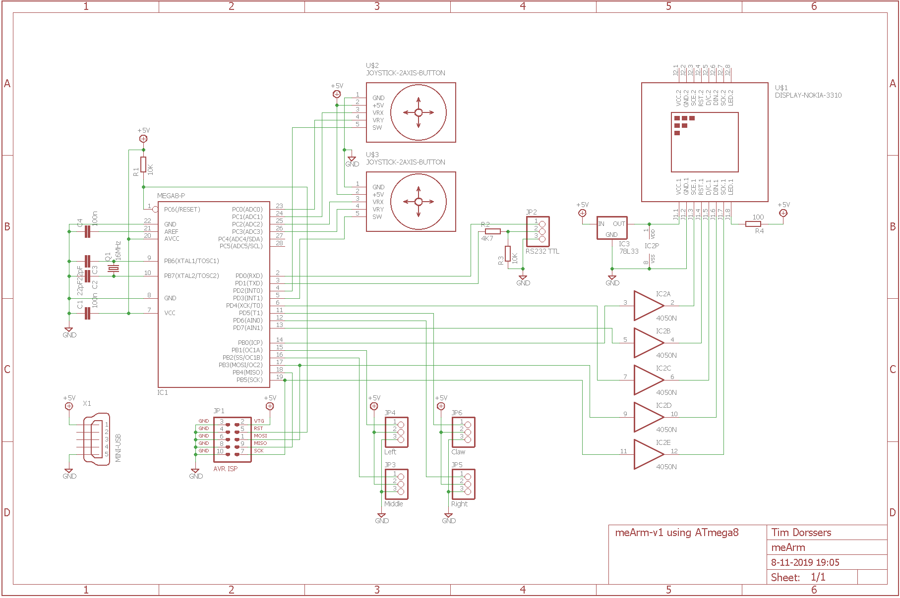
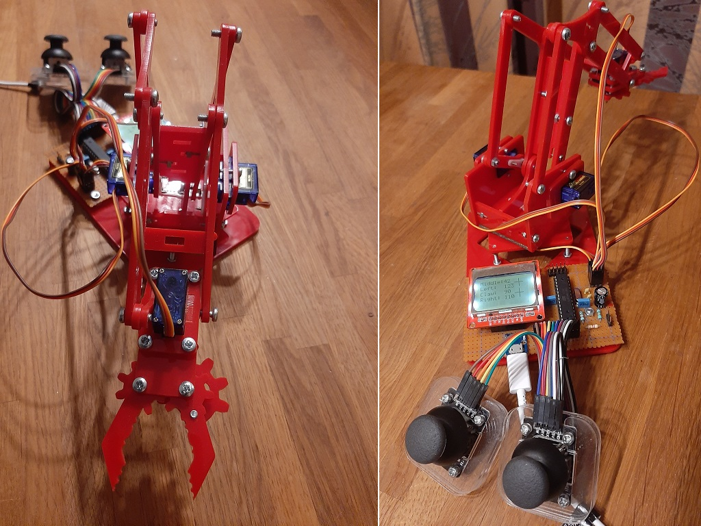

# meArm
[meArm v1](http://learn.mearm.com/docs/building-the-mearm-v1/) pocket sized DIY robotic arm

## Overview
The controller board has a PCD8544-based LCD screen connected to the AVR hardware SPI pins and two 2-axis joystick modules connected to the AVR ADC pins to interface with the user. The PCD8544 driver supports font scaling and line drawing and sends all data at once using a screen buffer of 504 bytes in AVR RAM.
Four SG90 servos are connected to two pins of PORTD and two pins of PORTB and are driven by a software PWM implementation using the 16-bit Timer1 output compare interrupt.
The joystick buttons are used to save and restore servo positions.
Debugging data is sent to the hardware UART.

## Hardware
* Atmel ATmega8 @ 16 MHz
* PCD8544 48x84 pixels matrix LCD controller
* SG90 servos
* 2-axis joystick module with button

## Schematic

## Build
The robotic arm is built using a meArm v1 body and the hardware listed is connected according to the schematic.

## Firmware
The firmware has been developed in Atmel Studio 7 using GCC C and can be uploaded to the ATmega8 using the ISP connector and an ISP programmer such as [USBasp tool](http://www.fischl.de/usbasp/) using [avrdude](http://www.nongnu.org/avrdude/):

`avrdude -p m8 -c usbasp -U flash:w:meArm.hex:i -U hfuse:w:0xD9:m -U lfuse:w:0xDE:m`
